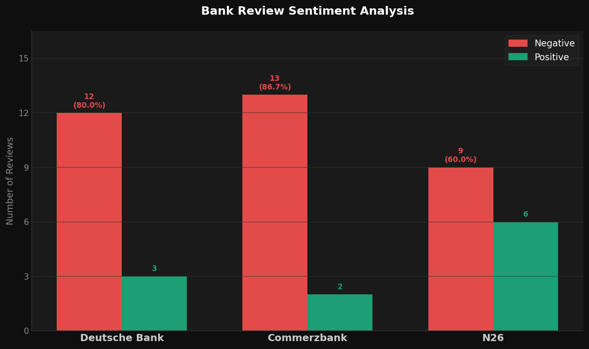

# Bank Review Sentiment Analysis

## Overview
This project analyzes customer reviews from three banks in Germany:
- Deutsche Bank
- Commerzbank
- N26

The goal was to understand how customers describe their experiences using publicly available feedback.

---

## Dataset
- 45 manually collected reviews (15 per bank)
- Sources: Trustpilot, Google Reviews, Trusted.de
- Each review classified as:
  - Positive or Negative
  - One main category (e.g. Customer Service, Digital Banking)

---

## Method
The analysis was performed using Python (pandas):

- Group reviews by bank and sentiment  
- Count positive and negative reviews  
- Calculate percentage of negative reviews  

---

## Results

| Bank | Total | Negative | Positive | Negative % |
|------|------|----------|----------|------------|
| Deutsche Bank | 15 | 12 | 3 | 80% |
| Commerzbank | 15 | 13 | 2 | 86.7% |
| N26 | 15 | 9 | 6 | 60% |

---

## Key Insights
- Within this dataset, customer reviews for Deutsche Bank and Commerzbank more frequently mention challenges related to customer service, such as response times and accessibility.

- Feedback across all banks highlights the importance of digital banking usability, including app functionality and login processes.

- Reviews for N26 often emphasize the simplicity and speed of the digital experience, while some customers mention situations where greater transparency would be beneficial.

- Due to the limited sample size, these observations should not be interpreted as representative, but rather as indications of patterns within the selected data.

---

## Technical Implementation
A simple Python script was used to:
- process the dataset  
- calculate metrics  
- support the visualization  

---

## Conclusion
This small project shows how customer reviews can be structured and analyzed to identify patterns in user experience.

---

## Personal Note
This project was inspired by concepts from an AI for Business course and represents a first practical step into data analysis using real-world data.
